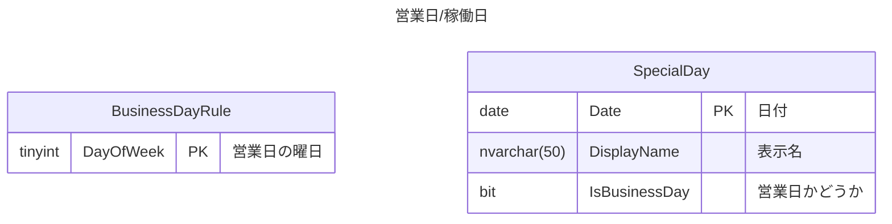

# 営業日/稼働日

## 要件
- 営業日や稼働日といった日付を管理する
- 日付のみを扱い、時間を扱わない
	- 要件の簡略化のため、営業時間/稼働時間などは一旦スコープ外とする

## データ構造

- BusinessDayRule：営業日/稼働日の曜日を定義する
- SpecialDay：特別な日付を定義する
	- 祝日や振替休日、逆に特別な営業日も考慮する

## サンプルデータ

