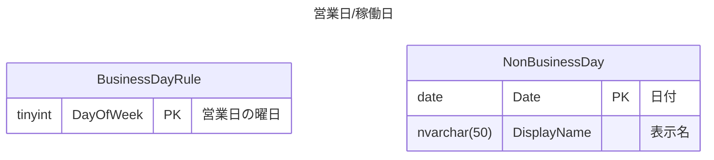

# 営業日/稼働日

## 要件
- 営業日や稼働日といった日付を管理する
- 要件の簡略化のため、下記は一旦スコープ外とし扱わない
	- 営業時間/稼働時間などの時間
	- 特別な営業日

## データ構造

- BusinessDayRule
	- 営業日/稼働日の曜日を定義する
		- .NETのDayOfWeekにあわせて、0:日曜日～6:土曜日
- NonBusinessDay
	- 特別な休業日（祝日や振替休日）を定義する



## サンプルデータ

例として
- 平日（月曜～金曜）は営業日とする
- 2026年5月の営業日一覧を取得する
- 2026年5月の祝日は下記
	- 5/3：憲法記念日
	- 5/4：みどりの日
	- 5/5：こどもの日
	- 5/6：振替休日

```sql
drop table if exists BusinessDayRule;
drop table if exists NonBusinessDay;

-- 営業日ルール
create table BusinessDayRule(
    DayOfWeek tinyint,
    constraint PK_BusinessDayRule primary key(DayOfWeek)
);

-- 休業日
create table NonBusinessDay(
    Date date,
    DisplayName nvarchar(50)
    constraint PK_NonBusinessDay primary key(Date)
);

-- 営業日ルール
-- .NETのDayOfWeekとして扱う
-- 月、火、水、木、金
insert into BusinessDayRule
values (1), (2), (3), (4), (5);

-- 休業日
-- 2026年5月の祝日
insert into NonBusinessDay
values
    ('2026-05-03', N'憲法記念日'),
    ('2026-05-04', N'みどりの日'),
    ('2026-05-05', N'こどもの日'),
    ('2026-05-06', N'振替休日');

-- 2026年5月の日付一覧を取得
declare @year int = 2026;
declare @month int = 5;

declare @first date = datefromparts(@year, @month, 1);
declare @end date = eomonth(@first);

with DateInMonth(Date)
as(
    select @first
    union all
    select dateadd(d, 1, Date)
    from DateInMonth
    where Date < @end
),
Calendar(Date, DayOfWeek)
as(
    select
        *,
        -- .NETのDayOfWeekとして
        (datepart(dw, Date) + @@datefirst - 1) % 7 as DayOfWeek
    from DateInMonth
)
select
    *,
    case when
        -- 営業日ルールに曜日が存在すること
        exists(
            select *
            from BusinessDayRule
            where BusinessDayRule.DayOfWeek = Calendar.DayOfWeek) and
        -- 休業日に存在しないこと
        not exists(
            select *
            from NonBusinessDay
            where NonBusinessDay.Date = Calendar.Date
        ) then 1
        else 0
    end as IsBusinessDay
from Calendar;
-- 実行結果
/*
Date        DayOfWeek   IsBusinessDay
----------  ----------  -------------
2026-05-01  5           1
2026-05-02  6           0
2026-05-03  0           0
2026-05-04  1           0
2026-05-05  2           0
2026-05-06  3           0
2026-05-07  4           1
2026-05-08  5           1
2026-05-09  6           0
2026-05-10  0           0
2026-05-11  1           1
2026-05-12  2           1
2026-05-13  3           1
2026-05-14  4           1
2026-05-15  5           1
2026-05-16  6           0
2026-05-17  0           0
2026-05-18  1           1
2026-05-19  2           1
2026-05-20  3           1
2026-05-21  4           1
2026-05-22  5           1
2026-05-23  6           0
2026-05-24  0           0
2026-05-25  1           1
2026-05-26  2           1
2026-05-27  3           1
2026-05-28  4           1
2026-05-29  5           1
2026-05-30  6           0
2026-05-31  0           0
*/
```